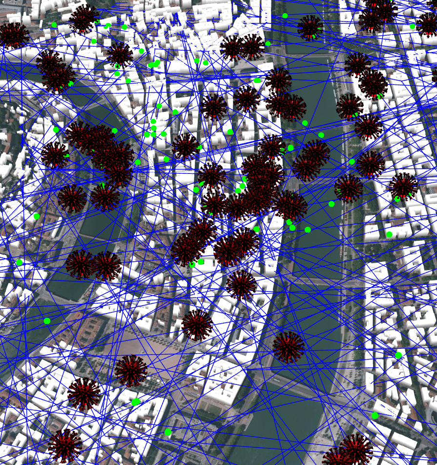

# Virus Spread

[](LICENSE)
[](https://github.com/username/repo/issues)
[](https://github.com/username/repo/stargazers)

The goal of this project is to "simulate" virus propagation within "ghosts" in Lyon. The healthy ghosts are pink, while the contaminated ghosts are green.





## Table of Contents

- [Installation](#installation)
- [Demo](#demo)
- [License](#license)

## Installation

Cloning the project:
```cmd
   git clone https://gitlab.com/kingatsa/virus-spread.gi
   cd virus-spread/src
```

In the folder **virus-spread/src**
```cmd
   npm i
   npm run build 
   npm run start
```

## Demo:

Link to the demo: [link](https://gtiazara.github.io/propagation_virus/)

   OBSERVATION: A traffic simulation (with car and BDTOPO road) would have been much more relevant for our approach of this short project.

## License

This project is licensed under the MIT License - see the [LICENSE](LICENSE) file for details.